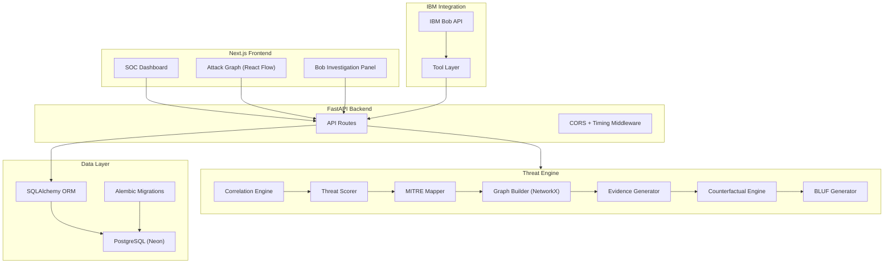
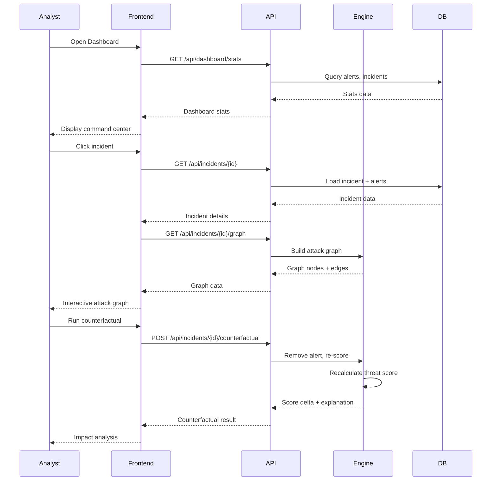
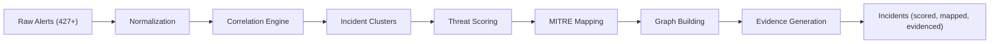
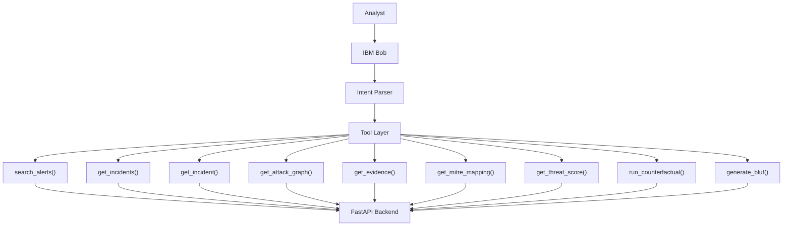
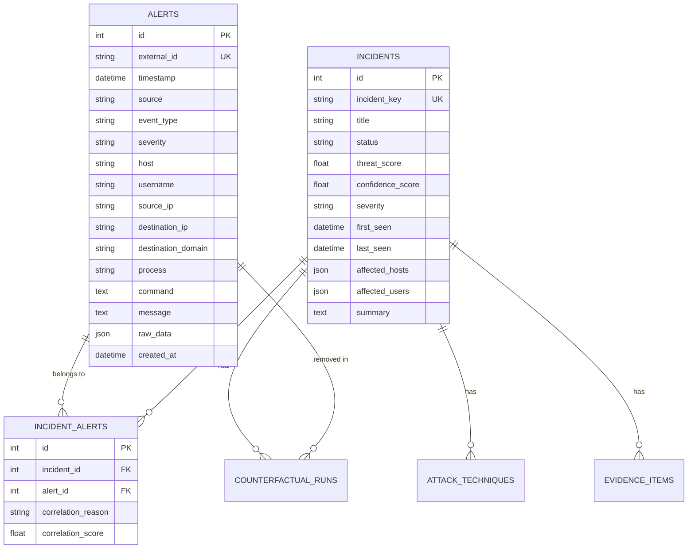

# Architecture

## System Architecture

## Component Overview

| Component | Technology | Purpose |
|-----------|-----------|---------|
| Frontend | Next.js 15, TypeScript, Tailwind, shadcn/ui | SOC dashboard, incident investigation, graph visualization |
| API Layer | FastAPI, Pydantic | REST API with typed request/response models |
| Database | PostgreSQL (Neon), SQLAlchemy, Alembic | Persistent storage with migrations |
| Correlation Engine | Python | Clusters related alerts into incidents |
| Threat Scorer | Python | Calculates threat and confidence scores |
| MITRE Mapper | Python | Maps events to ATT&CK techniques |
| Graph Builder | NetworkX | Constructs attack graphs |
| Evidence Generator | Python | Creates structured evidence items |
| Counterfactual Engine | Python | Re-scores with removed evidence |
| BLUF Generator | Python | Structures commander-ready summaries |
| IBM Bob Integration | IBM Bob API + Tool Layer | Conversational investigation |

## Data Flow

## Threat Processing Pipeline

**Pipeline steps:**

1. **Ingestion** — Alerts arrive via API or bulk import
2. **Normalization** — All sources mapped to unified Alert schema
3. **Correlation** — Alerts clustered by identity, host, IP, temporal proximity, and sequence
4. **Scoring** — Each cluster scored for threat level and evidence confidence
5. **MITRE Mapping** — Event types mapped to ATT&CK techniques
6. **Graph Construction** — Entity relationships modeled as directed graph
7. **Evidence Generation** — Structured evidence items created from patterns
8. **Storage** — Incidents, techniques, evidence persisted to PostgreSQL

## IBM Bob Tool Flow

## Security Considerations

- **No secrets in source code** — All credentials via environment variables
- **Parameterized queries** — SQLAlchemy ORM prevents SQL injection
- **Input validation** — Pydantic models validate all API inputs
- **CORS configuration** — Configurable allowed origins
- **Error sanitization** — Stack traces not exposed in production mode
- **XSS prevention** — React's default escaping + no dangerouslySetInnerHTML
- **Principle of least privilege** — LLM cannot modify data, only query
- **Audit logging** — Bob tool calls logged for transparency

## Database Schema

